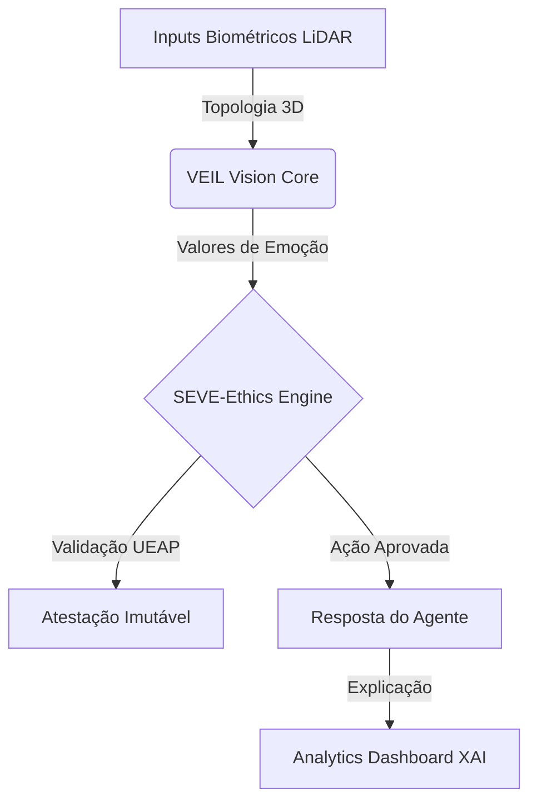

# 🛡️ SEVE UNIVERSAL V1.5: THE SOVEREIGN EDGE

**O Padrão Global de IA Ética e Empatia Computacional.**

---

### 📥 1. O PROBLEMA CENTRAL
As IAs de visão atuais falham em dois pilares críticos:
1. **Privacidade**: Dependem de fotos (RGB) que expõem a identidade e o ambiente do usuário.
2. **Confiança**: São "Caixas Pretas"; não explicam por que tomaram uma decisão ou geraram uma reação.

---

### 💡 2. A SOLUÇÃO: SEVE FRAMEWORK
O SEVE (Symbiotic Ethical Vision Engine) é a infraestrutura definitiva para IA em dispositivos de borda (Edge).

---

### 🚀 3. DIFERENCIAIS V1.5 (PROVADOS)

#### 👁️ VISÃO HIPER-PRIVADA
*   **Sensor**: LiDAR (Célebre por não usar fotos).
*   **Edge Processing**: Processamento local em milissegundos.
*   **Soberania**: Seus dados nunca tocam a nuvem.

#### 🧠 EMPATIA AUDITÁVEL (XAI)
*   **Raciocínio**: O agente justifica "Por que estou curioso?" ou "Por que detectei alerta?".
*   **Compliance**: Praticamente imune a GDPR e LGPD devido ao design de privacidade nativa.

#### 📊 ANALYTICS CÓRTEX
*   **Interface**: Dashboard React de alta performance.
*   **Target**: Decisores, gestores de risco e desenvolvedores.

---

### 📈 VALUATION & DATA
*   **Status**: MVP Funcional (v1.5) integrado com ESP32-S3 e Dashboards.
*   **Valuation Estimada (v1.5)**: **$2.0M USD**.
*   **Ask**: Buscamos parceiros para Pilotos Enterprise em Saúde e Educação.

---

**🌟 SEVE UNIVERSAL: IA SOBERANA, ÉTICA E HUMANA. 🌍🤖⚡**
